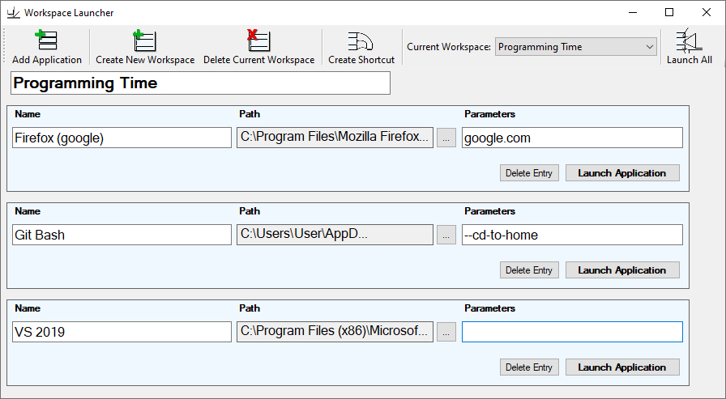

Workspace Launcher
=========

A small tool that allows for simultaneous launching of multiple applications.

## Command Line Parameters
The command line parameters are automatically set when creating a workspace shortcut from within the application.

**Existing parameters:**  
- `--id=(ID of the workspace that should be launched)` *launches all entries of the workspace*
- `--no-window` *closes the application without opening the main window*

## Screenshots
